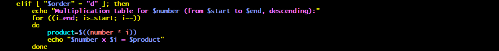
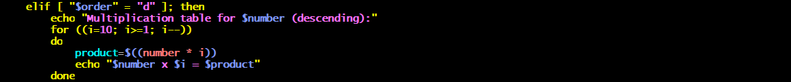
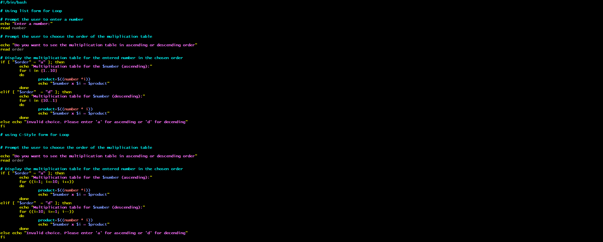

# Bash Script for Multiplication-table

## Objective 

The objective of this project is to create a Bash script that generates a full multiplication table. 

The code features loops to generate muliplication table. The 2 different kinds used are list form and C-style form. The code demonstrates the different methods of control flows (if -elif- else) to determine the user's choice of multiplication table (full or partial) as well as options for the chosen order of multiplication (ascending or descending order) embedded in the block statement

The script begins with a #!/bin/bash, this is called a shebang. It tells the system that this script shoud be executed uusing in a Bash shell, which is located at /bin/bash. 

# Using List form for loop 

 
The code start with prompting the User to input a number for which a multiplication table will be generated

As seen in the code, the command `echo` prompts the user to enter a number as soon as the shell script is executed. The `read` command takes the line of input from the user, reads this line of input and assigns it as a variable.

## Multiplication table choice and conditional logic 

The user is prompted with which type of multiplication table to use, full (f) or partial (p) 

Conditional logic (if-elif-else) is implemented for user's choice of multiplication table as a block statement.

- **The 'if' statement for a full multiplication**: 
The 'if' statement checks if a condition is true when the user selects "f" for a full multiplication table, 

- **The elif` statement for partial multiplication** 

- **The else statement for invalid input**: `else` statement checks when both above conditions are false. If the user fails to pick either above options (f/p), it executes it as an invalid choice. 

The conditional statement for the choice of mulitplication table is closed off with `fi` signifying an end to the block statement 

**Order of Multiplication table (ascending or descending)**

Embedded in the choice of multiplication table is the **order of multiplication**. 

 The User is prompted to enter the order of multiplication table Ascending (a) starts from the lowest to the highest, while descending stats form the highest to the lowest (b)

`echo` 

Conditional logic (if-elif-else) is also applied to the user choice of which order to use of multiplication.

`if` statement checks that the user wants the multiplication table in ascending order for which this condition is true, when the user selects 'a'
`elif` statement checks that the user wants the multiplication table in descending order, for which the above `if` statement is false when the user selects 'b'
`else` statments checks when both above conditions are false, and prompts the user to either enter an ascending (a), or descending (d) option. 

**Use of Loops on Full multiplication table**

After assigning a variable for the chosen order of mulitiplication. 

The for i in {1..10} initiates the loop, the loop iterates through the numbers 1 to 10 to generate the multiplication table. 
the 'i' in the loop is the item, its regarded as the variable that temporarily holds the value of each item in the list as the loop iterates.

Within the loop, the **do** keyword contains the command product=$((number * i)). It calculates the product of the user-provided number and the current iterator value (i).

echo "$number x $i = $product" prints out each line of the multiplication table.

The loop closes out with the statement `done`. it signifies that all commands in the loop have been executed for each item in the list. 

The `elif` statement is executed if the chosen order is descending, a similar work order is processed and executed for loops 
however in a descending fashion as the loop iterated throught the number (10 to 1) to generate the descending multiplication table.

The `else` statement checks when both above conditional statments are false 

The conditional statment is close of with `fi` signifying an end to the block statement. 

### Partial Multiplication table

The `elif` (else if) conditional statement checks on the condition that the `if` statement is false, "p" is chosen as partial multiplication table.
A partial multiplication table selection would require the user to specify the start and end of the range.

**Order of Mulitplication on partial multiplication table**

 The User is prompted to enter the order of multiplication table Ascending (a) starts from the lowest to the highest, while descending stats form the highest to the lowest (b), and it reads the order, hence assigning it as a variable when required.

**Use of loops on partial multiplication table**

With a partial multiplication table selection, there are some  differences compared to the full multiplication table. A new block statement is generated with a different conditional statment (if-elif-else). 

- if statement

The for "i" initiates the loop, loop iterates through the start of the range to the end to generate the multiplication table. 

Within the loop, the **do** keyword contains the command product=$((number * i)). It calculates the product of the user-provided number and the current iterator value (i).
echo "$number x $i = $product" prints out each line of the multiplication table.

The loop closes out with the statement `done`. it signifies that all commands in the loop have been executed for each item in the list. 

- elif statement

The `elif` statement is executed if the chosen order is descending, a similar work order is processed and executed for loops 
however in a descending fashion as the loop iterates from end of the range to the start of the range to generate a descending multiplication table.

- else Statement

The `else` statement checks when both above conditional statments are false 

The conditional statment for order of mulitiplication closes with `fi` signifying an end to the block statement. 

 

## Using C-Style form for loops

The C-style for loops is different from the list form, as it allows the user to specify an initializer, condition and increment/decrement expression.

Keeping everything else the same as the list form, only the differnce in the (C-style) code would be in loops

- For full multiplication in an ascending order

- Full multiplication in descending order 

- For Partial Multiplication in ascending order

- For Partial multiplication in descending order

Full code

